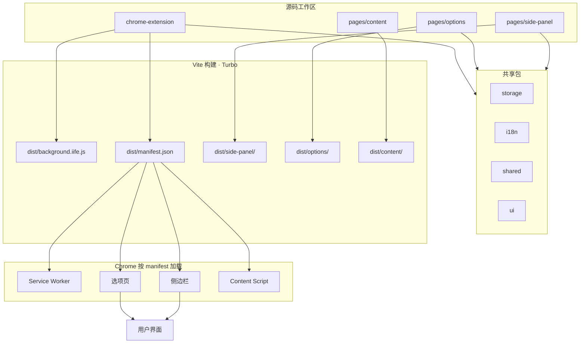
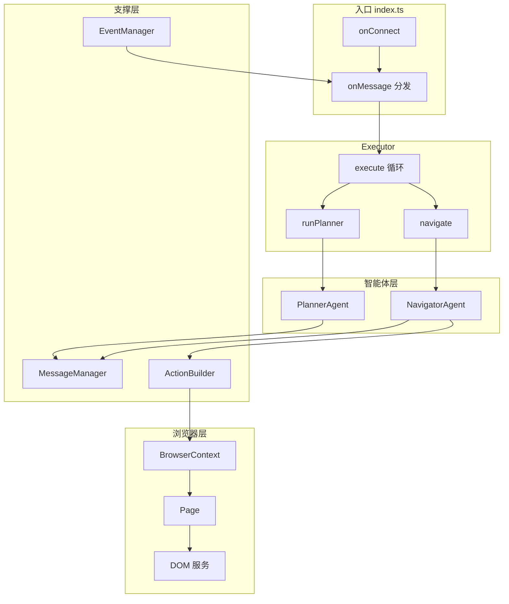
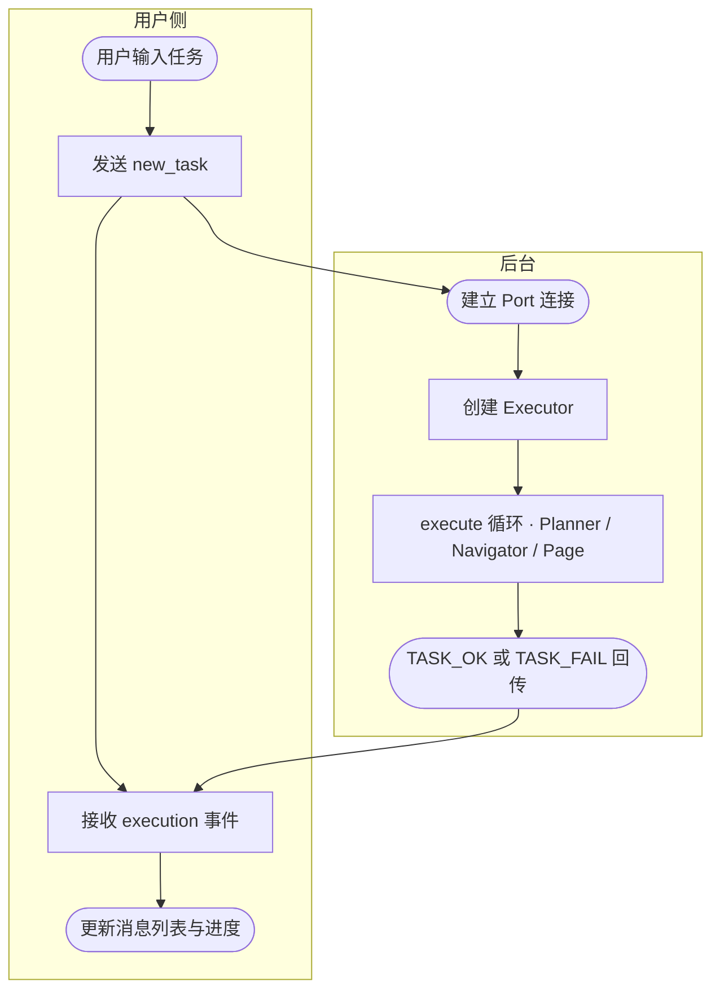
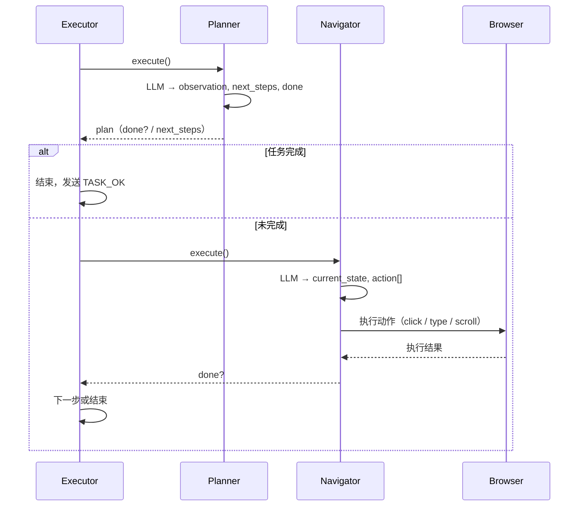
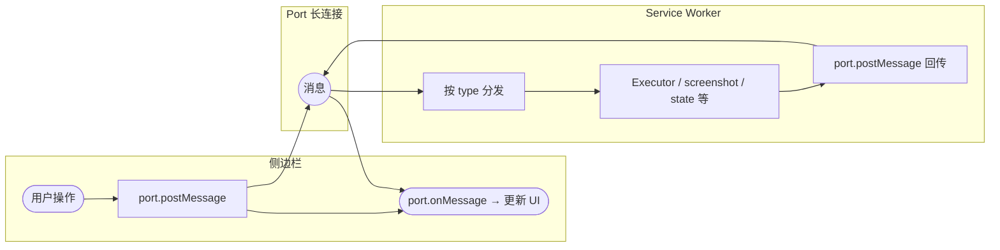
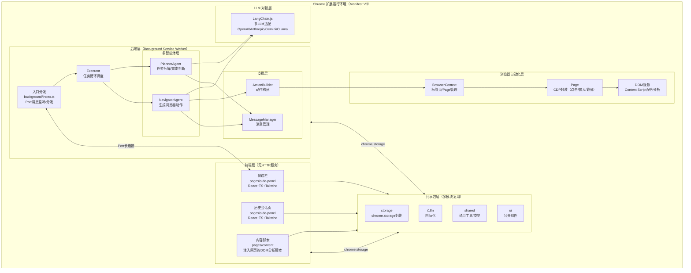

# AIHR

AIHR 是一款开源的 **AI 网页自动化** Chrome 扩展，在浏览器内运行多智能体系统，支持多种 LLM 提供商（OpenAI、Anthropic、Gemini、Ollama 等），可视为 OpenAI Operator 的免费替代方案。

## 技术栈

| 类别 | 技术 |
|------|------|
| 扩展 | Chrome Extension Manifest V3 |
| 前端 | React 18 · TypeScript · Tailwind CSS |
| 构建 | Vite · Turbo（Monorepo 任务编排） |
| AI | LangChain.js · 多 LLM 接入 |
| 自动化 | Chrome DevTools Protocol（点击、输入、截图等） |

---

## 项目结构

```
aihrbrowser/
├── chrome-extension/       # 扩展核心：Background Service Worker、Agent、Browser
├── pages/                  # 扩展 UI 与脚本
│   ├── side-panel/         # 侧边栏（主界面）
│   ├── options/            # 选项页（配置）
│   └── content/            # 内容脚本（注入页面）
├── packages/               # 共享包
│   ├── storage/            # 配置与存储
│   ├── i18n/                # 国际化
│   ├── shared/              # 通用工具与类型
│   ├── ui/                  # 公共 UI 组件
│   └── ...
└── pnpm-workspace.yaml     # pnpm 工作区
```

---

## 前端如何生成浏览器插件

本项目是 **Chrome 扩展（Manifest V3）**，前端不是独立网站，而是扩展内的多种页面与脚本，通过 **Manifest** 声明、**多工作区统一输出到 dist/** 的方式组成一只完整插件。

### 扩展形态

- **Background（Service Worker）**：`chrome-extension/` 用 Vite **lib 模式** 打成单文件 `background.iife.js`，在 `manifest.json` 中声明为 `background.service_worker`，随扩展常驻。
- **扩展页面**：侧边栏、选项页由各自工作区用 Vite 以 SPA 方式构建：
  - **侧边栏**：`pages/side-panel/` → `dist/side-panel/index.html` + 静态资源；Manifest 中 `side_panel.default_path: 'side-panel/index.html'`。
  - **选项页**：`pages/options/` → `dist/options/index.html`；Manifest 中 `options_page: 'options/index.html'`。
- **内容脚本**：`pages/content/` → `dist/content/index.iife.js`，在 Manifest 的 `content_scripts` 中配置注入到 `http(s)://*` 等页面。

### 构建与产物

- **Monorepo + Turbo**：根目录 `pnpm build` 按依赖顺序构建 `chrome-extension`、`pages/side-panel`、`pages/options`、`pages/content`，各包产物写入 **同一 dist 目录**。
- **Manifest 生成**：`chrome-extension` 的 Vite 插件 `makeManifestPlugin` 在构建结束时从 `manifest.js` 生成 `dist/manifest.json`，写入 side_panel、options_page、background、content_scripts 等路径。
- **加载方式**：在 `chrome://extensions` 选择「加载已解压的扩展程序」指向 `dist/`，Chrome 按 manifest 加载 background、侧边栏、选项页和 content script，**无需单独起 HTTP 服务**。

### 前端架构流程图



---

## 前端架构

- **侧边栏**（`pages/side-panel/`）：主交互界面，React + TypeScript + Tailwind；组件包括 SidePanel、ChatInput、MessageList、ChatHistoryList、BookmarkList；与 background 通过 Port 收发 `new_task`、`follow_up_task`、`cancel_task`、`execution` 等。
- **历史会话页**（`pages/side-panel/`）：展开历史会话记录。
- **内容脚本**（`pages/content/`）：注入到用户浏览的网页，配合 background 的 DOM 分析（可点击元素树等），不承载主 UI。
- **共享包**：`@extension/storage`、`@extension/i18n`、`packages/shared`、`packages/ui`、`packages/tailwind-config` 供前端与 background 共用。

---

## 前后端如何交互

前后端**不通过 HTTP/WebSocket**，而是用 **Chrome 扩展的进程间通讯 API** 和 **存储 API**。

### 1. Port 长连接（主通道）

- 侧边栏打开后调用 `chrome.runtime.connect({ name: 'side-panel-connection' })`，与 Background Service Worker 建立一条 **长连接 Port**。
- **前端 → 后台**：`port.postMessage({ type: 'new_task', task, tabId, taskId })`，以及 `follow_up_task`、`cancel_task`、`pause_task`、`resume_task`、`state`、`screenshot`、`speech_to_text`、`replay` 等。
- **后台 → 前端**：在 `chrome.runtime.onConnect` 里收到连接，用 `port.onMessage.addListener` 处理消息；执行完后通过 **同一条 Port** 回传 `port.postMessage({ type: 'execution', ... })` 或 `{ type: 'error', error }`、`{ type: 'success', ... }` 等。
- 侧边栏通过 `port.onMessage.addListener` 接收并更新 UI（MessageList、进度、错误提示）。另有 `heartbeat` / `heartbeat_ack` 保活；侧边栏关闭或崩溃时 Port 断开，Background 在 `port.onDisconnect` 里清理（如取消当前任务）。

### 2. chrome.storage（配置与历史）

- 扩展配置、聊天历史、收藏等通过 `@extension/storage` 封装 **chrome.storage** 读写。
- 侧边栏、选项页、Background 在同一扩展内 **共用同一份 storage**，无需再发消息同步；选项页改配置后，Background 和侧边栏下次读取即可拿到新值。

### 小结

| 用途 | 方式 |
|------|------|
| 请求 / 响应 / 事件推送 | Port 长连接（`chrome.runtime.connect` + `port.postMessage` / `port.onMessage`） |
| 配置与持久化 | chrome.storage，多端共享，无独立后端接口 |

---

## 后端架构（Background）

后端运行在 Chrome 扩展的 **Service Worker（background）** 中，负责多智能体编排、LLM 调用和浏览器自动化。

### 入口与生命周期（`chrome-extension/src/background/index.ts`）

- 监听 `chrome.runtime.onConnect`，校验来自侧边栏的 `side-panel-connection`。
- 按消息类型分发：`new_task` → 创建 Executor 并执行；`follow_up_task` / `cancel_task` / `pause_task` / `resume_task` / `state` / `screenshot` / `speech_to_text` / `replay` 等。
- 管理当前 `Executor`、`BrowserContext`，可选本地配置（如 `aihr.config.local.json`）。

### 执行器（Executor）

- **职责**：任务循环的调度者，按步调用 Planner 与 Navigator，在完成或步数上限时结束。
- **依赖**：PlannerAgent、NavigatorAgent、MessageManager、EventManager、BrowserContext、ActionBuilder。
- **流程**：按 `planningInterval` 或 Navigator 返回 done 时调用 Planner；每步调用 Navigator 执行动作；支持暂停/恢复/取消、历史回放（replay）。

### 多智能体

| 智能体 | 文件 | 职责 |
|--------|------|------|
| **Planner** | `agent/agents/planner.ts` | 判断是否网页任务（web_task）、拆解步骤，产出 observation / challenges / next_steps / final_answer / reasoning / done；非网页任务直接给 final_answer。 |
| **Navigator** | `agent/agents/navigator.ts` | 根据当前状态和 next_steps 调用 LLM，输出 current_state + action 列表；通过 ActionBuilder 执行 click、type、scroll、done 等。 |

两者继承 `BaseAgent`，共用 LLM 调用、结构化输出/工具调用解析、错误处理与 Navigator 格式回退。

### 浏览器自动化（`browser/`）

- **BrowserContext**：管理当前 Tab、多个 Page 实例（attach/detach）。
- **Page**：封装对单个标签页的操作（CDP 等），如点击、输入、截图、高亮。
- **DOM 服务**：构建可交互元素树，供 Navigator 与 LLM 使用；Content Script 配合注入脚本收集 DOM。

### 后端架构流程图



---

## 整体业务流程图

从用户输入任务到侧边栏收到执行结果，整体分为：**建立连接 → 后台循环（规划 + 执行）→ 事件回传**。

### 整体任务执行流程



### Planner 与 Navigator 协作（单步）



### 前后端通讯流



---

前后端架构图



## 开发与构建

- **包管理**：`pnpm`（必须）。
- **安装**：`pnpm install`
- **开发**：`pnpm dev`（Turbo watch，多包同时 dev）。
- **构建**：`pnpm build`；扩展产物在 `dist/`，在 Chrome 中加载为「已解压的扩展」。
- **类型检查**：`pnpm type-check`
- **测试**：`pnpm -F chrome-extension test`（单元）、`pnpm e2e`（端到端，会先 build + zip）。

在 `chrome://extensions/` 开启「开发者模式」，选择「加载已解压的扩展程序」并指向项目根目录下的 `dist/`。

---

## 文档与规范

- **CLAUDE.md**：面向 AI 助手的项目说明、命令、目录约定、i18n 与安全注意点。
- **packages/i18n**：文案 key 的命名与生成流程；源码在 `locales/`，生成产物在 `lib/`，请勿直接修改生成文件。

---

## 许可证

Apache-2.0（见 [LICENSE](LICENSE)）。
